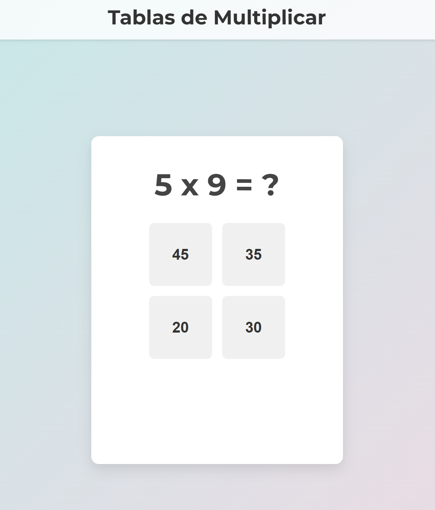

# Multiplicar
Web interactiva para practicar el cálculo mental con multiplicaciones simples, desarrollado con HTML, CSS y JavaScript. Genera preguntas de multiplicación aleatorias y ofrece respuestas de opción múltiple con retroalimentación inmediata.

### Características

- **Generación Dinámica de Preguntas:**  
  Se generan preguntas de multiplicación aleatorias utilizando dos números entre 1 y 9.

- **Opciones de Respuesta:**  
  Se muestra una respuesta correcta y tres distractores para desafiar al usuario.

- **Retroalimentación Inmediata:**  
  Se resalta la respuesta correcta en verde y la incorrecta en rojo, mostrando mensajes de confirmación.

- **Mecanismo de Pistas:**  
  Si no se selecciona una respuesta en 3 segundos, se activa una pista que resalta la opción correcta mediante un efecto parpadeante.

- **Diseño Moderno:**  
  Cuenta con un diseño moderno y flexible que se adapta a diferentes dispositivos.

### Funcionamiento

1. **Generación de la Pregunta:**  
   Se seleccionan dos números aleatorios y se muestra una pregunta de multiplicación (por ejemplo, `3 x 4 = ?`).

2. **Opciones de Respuesta:**  
   Se crean cuatro botones:
   - Uno muestra la respuesta correcta.
   - Los otros tres muestran respuestas erróneas.

3. **Interacción del Usuario:**  
   Al seleccionar una opción:
   - Se muestra retroalimentación visual inmediata.
   - Si la respuesta es correcta, el botón se vuelve verde y se muestra el mensaje "¡Correcto!".
   - Si es incorrecta, el botón seleccionado se vuelve rojo y se indica cuál era la respuesta correcta, resaltando también la opción correcta.

4. **Función de Pista:**  
   Si el usuario no responde en 3 segundos, se activa un efecto parpadeante en el botón que contiene la respuesta correcta. En la siguiente ronda se repetirá la misma pregunta.

5. **Avance a la Siguiente Pregunta:**  
   Tras responder, aparece un botón "Siguiente" que permite al usuario continuar con una nueva pregunta.

### Probar el código

Simplemente descarga el archivo HTML y ejecútalo. Se puede abrir con cualquier navegador, como Chrome.
